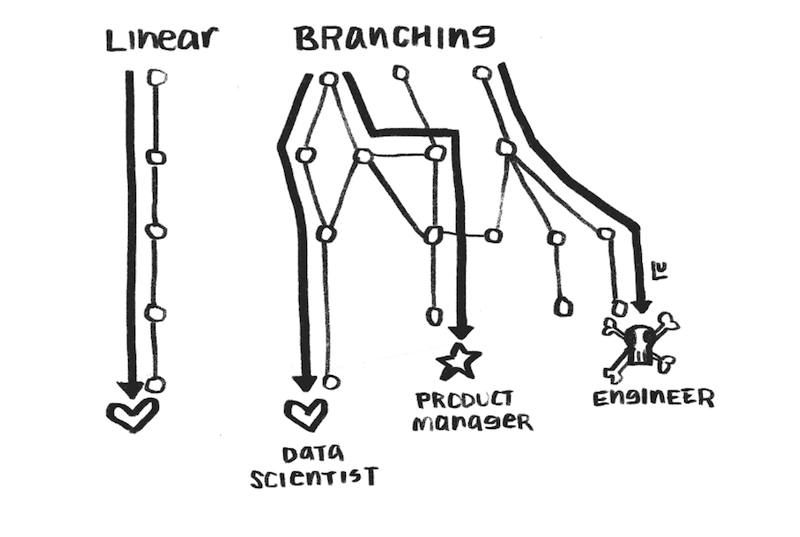
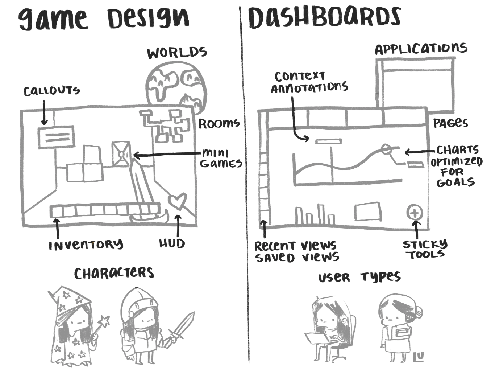

# Projeto de Análise de Órgão


## Visão geral do projeto:

O projeto consiste em uma análise do Projeto de Lei Orçamentária 2021 – PLOA 2021 – de forma auxiliar os gestores do TN em suas domadas de decisões. Inicialmente, o trabalho possui 3 etapas:

1.	Análise do PLOA 2021 do Ministério da Economia quanto a Despesas com controle de Fluxo pelo Poder Executivo (discricionárias);
2.	Ampliação do estudo estatístico para outros órgãos;
3.	Avaliação da execução dos órgãos e previsões mensais de despesas.


## Objetivos:
•	Realizar análises das Despesas da PLOA2021 [ME e despesas discricionárias, primeiro momento] de forma a auxiliar os gestores do TN em suas respectivas tomadas de decisões;
•	Utilização de ferramentas estatísticas (médias, desvios padrões, sazonalidade, taxas de crescimentos, etc) que auxiliem na mensuração e comparação das despesas do PLOA2021 e anteriores;
•	Elaborar previsões factíveis sobre as distintas despesas como contraponto inicial às LOA’s (maior previsibilidade das despesas);
•	Integrar metodologias desenvolvidas em sistema próprio da COFIN [módulos automatizados].


## Requisitos/Tarefa(s):
•	Criação de base e início do estudo estatístico:
  - Captação de dados do SIAFI com ajustes e incorporação de dados do PLOA/LOA em excel, conforme recebidos da SOF.

•	Delimitação de órgãos do PLOA/LOA a serem estudadas em ordem de priorização (proposta inicial = Ministério da Economia) – Despesas com controle de Fluxo do Poder Executivo no primeiro momento.

•	Revisão e construção de agregadores dos órgãos delimitados:
  - Rever a agregação a nível de ação orçamentária por órgão.

•	Comparação do PLOA/LOA de 2021 com a LOA dos anos anteriores, segundo a priorização delimitada:
  - Captação das informações via excel ou SIAFI;
  - Base já estruturada e criação de lógica de previsão anual de despesas.

•	Apresentação Gráfica dos Resultados.


## Prazo 

A Etapa 1 deste projeto está com previsão de conclusão em dezembro de 2020.


## Cronograma Detalhado


| TAREFA | DATA DE CONCLUSÃO | STATUS |
| ------ | ----------------- | ------ |
| Etapa 1 – Análise PLOA 2021: Despesas Discricionárias ME. | 11/12/2020	| 0% |
| 1.1 – Criação de Base de Dados.	| 20/10/2020	| 0% |
| 1.2 – Delimitação e construção de agregadores dos órgãos delimitados.	| 26/10/2020 |	0% |
| 1.3 - Comparação do PLOA/LOA de 2021 com a LOA dos anos anteriores (estudo estatístico). | 09/11/2020 |	0% |
| 1.4 - Comparação do PLOA/LOA com a execução de anos anteriores, fazendo uma previsão inicial de despesas anuais própria como contraponto à LOA.	| 23/11/2020 |	0% |
| 1.5 - Apresentação Gráfica dos Resultados.	| 11/12/2020 | 0% |
| Etapa 2 - Ampliação do estudo estatístico para outros órgãos	| A Definir	| |
| Etapa 3 - Avaliação da execução dos órgãos, e previsões mensais de despesas |	A Definir	| |


## To-do

Ver arquivo sobre Make do Mike Bostock para estruturar
https://bost.ocks.org/mike/make/

## Journal

Às vezes, um projeto está bem nebuloso e indefinido, e você acaba evitando trabalhar nele. Não te traz uma coisa boa. Aí, numa conversa, numa reunião, algo surge que provoca uma epifania, e os objetivos do projeto ficam mais claros, uma solução surge e tudo flui. Isso aconteceu na reunião de 3/11/2020 com o Gabriel.

O desafio vai ser construir algo como diz o Moritz:

> Where is the middle ground of domain-specific, purposefully crafted user interfaces that would truly enable us to see beyond the numbers and data and actually investigate interesting phenomena?

Moritz também inspira com:

> You will often hear these days, that data visualization is great for “telling stories”, to “make the complex simple” or to “make boring facts exciting”.
> While this all true to some degree, I think it misses the greatest quality of data visualization today: to provide us with new kinds of “glasses” to see the world. [...]
> We have this device now on our hands: data science and data visualization. It provides with new kinds of “glasses” to look at the world, a body extension that gives us the superpower to change the realities we are looking at, beyond the physical world.

Para isso, vislumbro usar algo como definido pela Susie Lu:

> When done well, exploratory data visualizations do have a story. It's a choose your own adventure story, a branching narrative. [...]
> In explanatory scrollytelling you see much more success in using storytelling devices such as setting the scene, introducing concepts bit by bit, providing strong contrast, and directing the narrative to a climax in the story. While directing the narrative is difficult in an exploratory mode, we can still learn from the other aspects of telling a story to design dashboards more effectively. [...]
> Scrollytelling is optimized for a single visit by a general audience member, while dashboards are optimized for multiple visits by many types of users. This affords two ways of approaching narrative.

Aqui principalmente: 

**"Branch the narrative based on the type of goal you have in mind. Different users will be interested in different types of insights."**



> Even if you don't know what the data will show over time, you can optimize the type of visualization, color choices, style, and annotations to design for specific goals.

> The second type of branching results from dynamic data in dashboards. Framing dashboards as storytelling allows you to turn this into an opportunity to change the narrative depending on the data instead of using the same chart type and annotations on a visualization that is no longer the best suited design.

**"Branch the narrative based on the type of data you have. Optimize your visualizations for different data scenarios."**

> With dashboards, you want to make the user so delighted with their experience that they come back whenever they need to answer a question with your data.

> The perspective of thinking of dashboards as a choose your own adventure story allows us to not only lean on devices from novels but also game design. This analogy gives a mental model for us to look at how we can improve our work on dashboards.



> DESIGN FOR MULTIPLE VISITS / QUICKLY RECOGNIZED FEATURES
> From a game design perspective this applies to clearly marking what your user can interact with. 
> You can also pull in the concept from game design of using a Heads Up Display (HUD). These are items that stay in your player's view and provide additional information on the state of the game. A representation of that is using a sticky nav or sticky context in your dashboard to be thoughtful about what tools a user will need in different parts of your application.

Então, é preciso definir bem esses objetivos da visualização.

### Objetivos de informação

#### Fornecer uma visão geral das despesas de um órgão

* 

#### Permitir a exploração e descoberta de ações inusitadas

* que ações tiveram um maior crescimento?
* que ações são novas?

#### Permitir a obtenção de detalhes nas duas visões

Na visão por agrupador, mostrar informações sobre o agrupador num card.

Na visão por ação, a mesma coisa, em cards.

#### Permitir busca textual de agrupadores, ações, descrições etc.


### Os dados

Precisamos ter dados de:

* PLOA ano [i+1]
* PLOA anos [i], [i-1]
* Dotação Atualizada anos [i], [i-1]
* Valor pago anos [i], [i-1]
* RAP inscritos [i+1], [i]
* RAP pagos

Detalhados por:

* Órgão (classificação Cofin)
* Ação
* Agrupador (a definir)
* Subfunção
* Função da subfunção
* GND

Para cada ação podemos calcular métricas como:

* Execução / Dotação + RAP nos anos [i] e [i-1]
* Aumento Dotação de [i-1] para [i]
* Pagto RAP / Pagto Total
* como conjugar aumento percentual com valor absoluto? (fazer gráfico de dispersão?)

### Estrutura do código

vis
|
=- params
=- init
=- f
   |
   =- scales
      |
      =- domain

Controlar o estado com data-attributes?

Para cada seleção, atualizar a escala?
O range não vai mudar, mas o domain sim

então poderia pegar armazena num data-attribute o estado, tipo
data-modo = "agregado"
data-opcao = "funcao_tipica"

E aí teria os domains armazenados dessa forma, tipo

```
domains
 |
 +- agregado
    \- todos
 \- detalhado
    |
    +- alteracoes
    +- novos
    \- outro
```

Então um método varia o update da escala, tipo

vis.draw.scales[dataModo].x.domain(
  vis.draw.domains[dataModo][dataOpcao]
)

ooou, os dominios seriam mais sinteticos, de acordo com as variaveis

```
domains
   |
   +- atu_total
   +- varia
   +- varia_pct
```

e só teria uma escala por ~modo~ dimensão, que seria atualizada no momento da seleção, com o domínio correspondente.

O objeto contém uma lista de variáveis de interesse, com os mesmos nomes das colunas dos dados, e constrói um range para cada uma delas.


Precisaria  ?


 O back-and-forth entre a construção da visualização e a preparação dos dados no R.


### Inspirações

Minimap o 
 https://pudding.cool/process/pivot-continue-down/